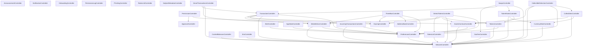

```mermaid
graph TB
  AddressBookController
  AnnouncementController
  ApprovalController
  KeyringController
  NetworkController
  NotificationController
  OnboardingController
  PermissionLogController
  PhishingController
  RateLimitController
  SubjectMetadataController
  AlertController --> PreferencesController
  AppStateController --> PreferencesController
  CachedBalancesController --> NetworkController
  CurrencyRateController --> NetworkController
  EnsController --> NetworkController
  GasFeeController --> NetworkController
  PreferencesController --> NetworkController
  TokenListController --> NetworkController
  AssetsContractController --> PreferencesController
  AssetsContractController --> NetworkController
  IncomingTransactionsController --> PreferencesController
  IncomingTransactionsController --> NetworkController
  MetaMetricsController --> PreferencesController
  MetaMetricsController --> NetworkController
  PermissionController --> KeyringController
  PermissionController --> ApprovalController
  TokensController --> PreferencesController
  TokensController --> NetworkController
  CollectiblesController --> CurrencyRateController
  CollectiblesController --> NetworkController
  CollectiblesController --> AssetsContractController
  SmartTransactionsController --> NetworkController
  SmartTransactionsController --> MetaMetricsController
  SmartTransactionsController --> TransactionController
  TokenRatesController --> TokensController
  TokenRatesController --> CurrencyRateController
  TokenRatesController --> NetworkController
  CollectibleDetectionController --> CollectiblesController
  CollectibleDetectionController --> PreferencesController
  CollectibleDetectionController --> NetworkController
  CollectibleDetectionController --> AssetsContractController
  SwapsController --> NetworkController
  SwapsController --> TokenRatesController
  SwapsController --> TransactionController
  SwapsController --> GasFeeController
  ThreeBoxController --> PreferencesController
  ThreeBoxController --> AddressBookController
  ThreeBoxController --> KeyringController
  ThreeBoxController --> MetaMetricsController
  TransactionController --> PreferencesController
  TransactionController --> NetworkController
  TransactionController --> KeyringController
  TransactionController --> MetaMetricsController
  TransactionController --> AssetsContractController
  DetectTokensController --> PreferencesController
  DetectTokensController --> NetworkController
  DetectTokensController --> TokensController
  DetectTokensController --> AssetsContractController
  DetectTokensController --> KeyringController
  DetectTokensController --> MetaMetricsController
  DetectTokensController --> TokenListController
```
